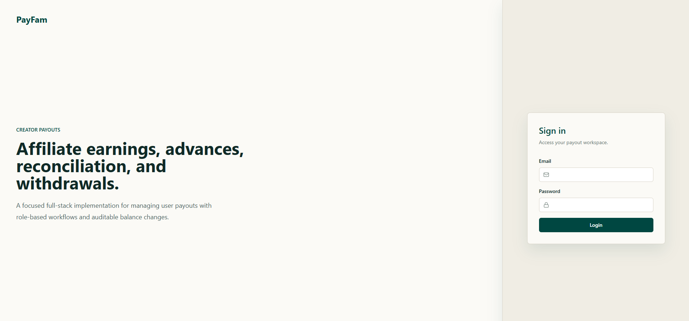
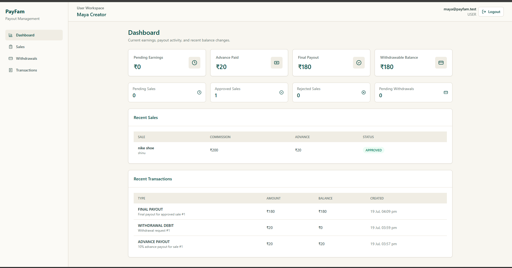
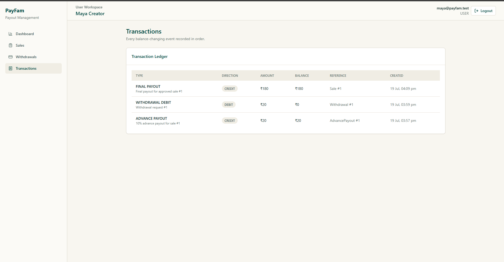
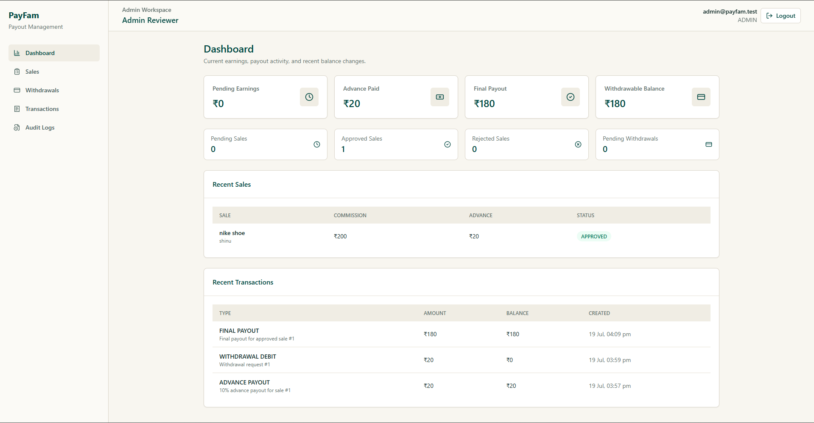
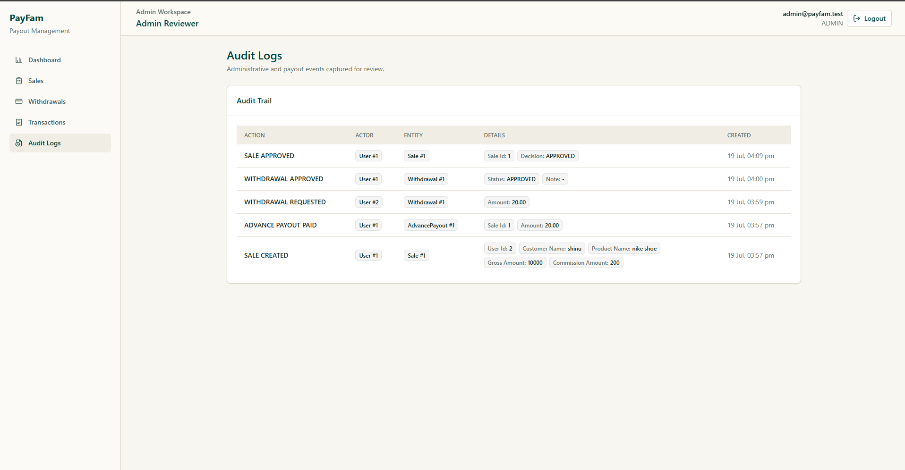

# PayFam - Payout Management System

PayFam is a comprehensive full-stack application built for managing creator affiliate sales, advance payouts, final reconciliation, withdrawals, and an automated transaction ledger.

This project was built as a solution for a robust payout management system.

##  Features

- **Role-based Dashboards:** Dedicated views for Admin and User roles.
- **Advance Payouts:** Automated 10% advance payout on pending sales with duplicate-prevention.
- **Reconciliation:** Approve or reject sales with automated final adjustments.
- **Withdrawal System:** Only 1 withdrawal every 24 hours. Failed/rejected withdrawals are securely refunded.
- **Transaction Ledger:** Immutable ledger capturing every balance-changing event.
- **Audit Logs:** Full traceability for administrative and payout events.

##  Screenshots

### 1. Home / Login Page


### 2. User Interface



### 3. Admin Interface



##  Tech Stack

**Backend:**
- Python, FastAPI
- SQLAlchemy, SQLite
- Pydantic, JWT Authentication

**Frontend:**
- Next.js, TypeScript
- Tailwind CSS, shadcn-style UI primitives
- Lucide Icons

##  How to Run

### Start the Backend

```bash
cd backend
python -m venv .venv
# On Windows use: .venv\Scripts\activate
# On Mac/Linux use: source .venv/bin/activate
pip install -r requirements.txt
uvicorn app.main:app --reload
```
The backend API docs will be available at `http://127.0.0.1:8000/docs`.

### Start the Frontend

```bash
cd frontend
npm install
npm run dev
```
The frontend will run at `http://localhost:3000`.

##  Seed Login Details

When the backend starts with an empty database, it automatically generates these seed users so you can log in and test immediately without needing to create accounts.

**Admin:**
- Email: `admin@payfam.test`
- Password: `admin123`

**User:**
- Email: `maya@payfam.test`
- Password: `user123`

## 📂 Project Structure

```text
payfam/
  backend/          # FastAPI monolith API & business logic
  frontend/         # Next.js React Dashboard
  images/           # Project screenshots
  LLD.md            # Low-Level Design Architecture
  README.md         # Project documentation
```
